# Основы оркестрации контейнеров

Использование инструментов docker compose и docker swarm для совместного запуска контейнеров и их простейшей оркестрации.

## Contents

1. [Chapter I](#chapter-i)
2. [Chapter I](#chapter-ii) \
   2.1. [Запуск нескольких docker-контейнеров с использованием docker compose](#part-1-запуск-нескольких-docker-контейнеров-с-использованием-docker-compose) \
   2.2. [Создание простейшего docker swarm](#part-2-создание-простейшего-docker-swarm)
## Chapter I

Необходимо развернуть приложение, построенное на микросервисной архитектуре. Приложение состоит из 10 сервисов(postgresql, rabbitmq и 8 сервисов, написанных на Java). Схема разворачиваемого приложения и дополнительнпя информация содержится в директории materials. Требуется: 

1. Cоздать docker compose файл, который позволит развернуть сервисы в docker контейнерах.                          
2. Cоздание кластера, в котором будем разворачиваться на прошлом этапе docker compsoe file, при помощи docker swarm. Кластер будет состоять из 3 нод(2 worker и manager). В кластер будут объединены виртуальные машины, созданные при помощи Vagrant.

## Chapter II

## Part 1. Запуск нескольких docker-контейнеров с использованием docker compose
**== Задание ==**

1) Написать Dockerfile для каждого отдельного микросервиса. Необходимые зависимости описаны в материалах. В отчете отобразить размер собранных образов любого сервиса различными способами.

2) Написать docker-compose файл, который осуществляет корректное взаимодействие сервисов. Пробросить порты для доступа к gateway service и session service из локальной машины. Помощь по docker compose в материалах.

3) Собрать и развернуть веб-сервис с помощью написанного docker compose файла на локальной машине.

4) Прогнать заготовленные тесты через postman и удостовериться, что все они проходят успешно. Инструкцию по запуску тестов можно найти в материалах. В отчете отобразить результаты тестирования.

**Решение**

1) Dockerfiles  
1.1) Сборка микросервисов  
`mvn package -DskipTests`   
`
mvn -N io.takari:maven:wrapper
`   
1.2) Dockerfile для микросервисов( Session service, Hotel service, Booking service, Payment service, Loyalty service Report service, Gateway service)  
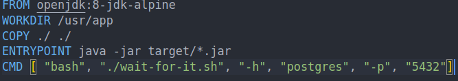  
1.3) Dockerfile для database    
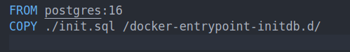  
1.4) Просмотр размеров образов различными способами
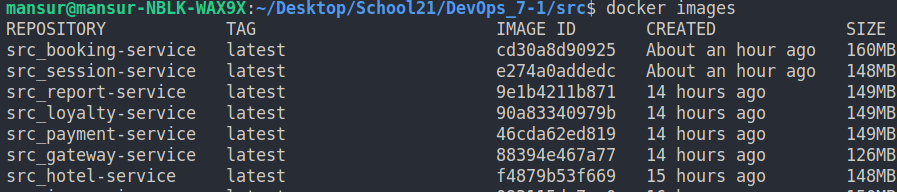
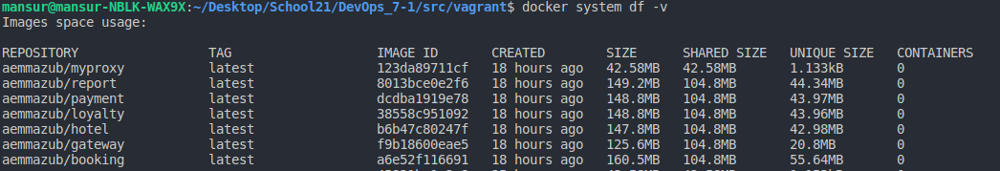
2. Docker-compose   
2.1) docker-compose.yml лежит в корне проекта.
Проброшены порты к всем сервисам:
- Session service - 8081
- Hotel service - 8082
- Booking service - 8083
- Payment service - 8084
- Loyalty service - 8085
- Report service - 8086
- Gateway service - 8087
3) Запуск docker-compose   
3.1) Запуск `docker-compose up -d`
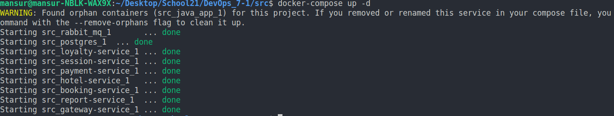
3.2) Просмотр запущенных контейнеров `docker ps`
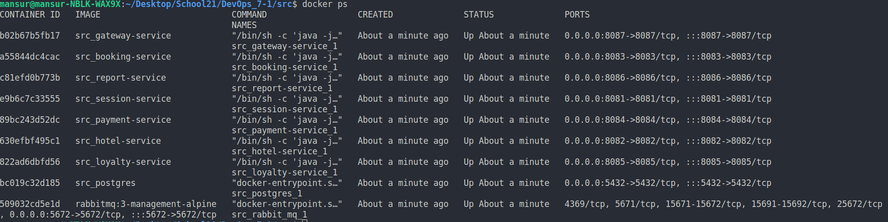  
4) Postman  
4.1) Запуски Postman c заготовленными тестами
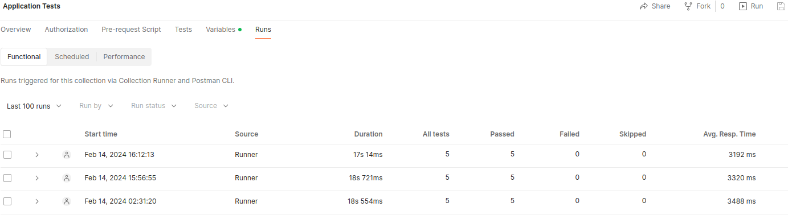

## Part 2. Создание простейшего docker swarm

**== Задание ==**

1) Модифицировать Vagrantfile для создания трех машин: manager01, worker01, worker02. Написать shell-скрипты для установки docker внутрь машин, инициализации и подключения к docker swarm. Помощь с docker swarm материалах.  
**Решение:** 
- Изменил Vagrantfile для создания 3 виртуальных машин: manager01, worker01, worker02. Измененил ip на машинах, добавил сетевую папку для обмена токеном для Docker Swarm, добавил копирования скриптов для инициализации node.
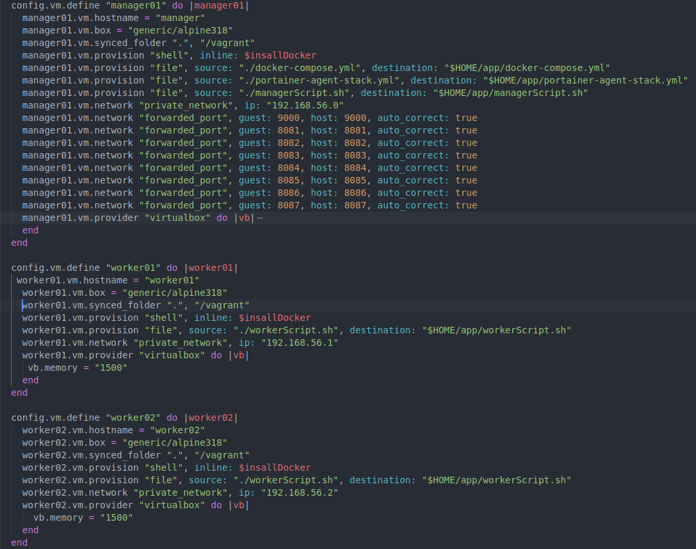
- Shell скрипты:  
Инициализует ноду manager, создает файл с токеном, чтобы не копировать его в терминал. managerScript.sh:
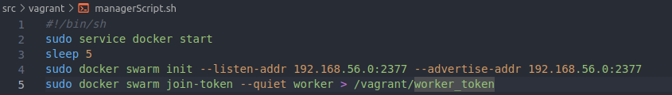
- Инициализует ноду worker через worker_token. workerScript.sh:  
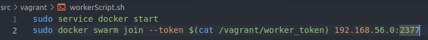

2) Загрузить собранные образы на docker hub и модифицировать docker-compose файл для подгрузки расположенных на docker hub образов.  
**Решение:** 
- Образы на Dockerhub
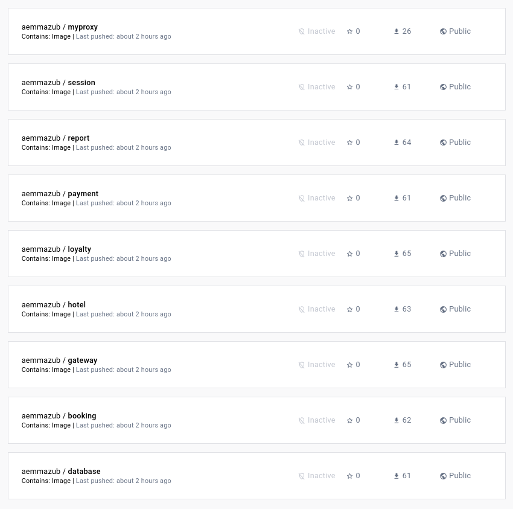
- Изменил в docker-compose.yml директиву build на image и указал обрзазы, которые необходимы. Пример:  
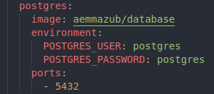
3) Поднять виртуальные машины и перенести на менеджер docker-compose файл.Запустить стек сервисов, используя написанный docker-compose файл.  
**Решение:** 
- Запуск стэк сервисов `docker stack deploy -c PATH NAME_STACK`
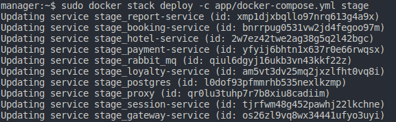

4) Настроить прокси на базе nginx для доступа к gateway service и session service по оверлейной сети. Сами gateway service и session service сделать недоступными напрямую.   
**Решение:**  
- nginx.conf для проксирования запросов
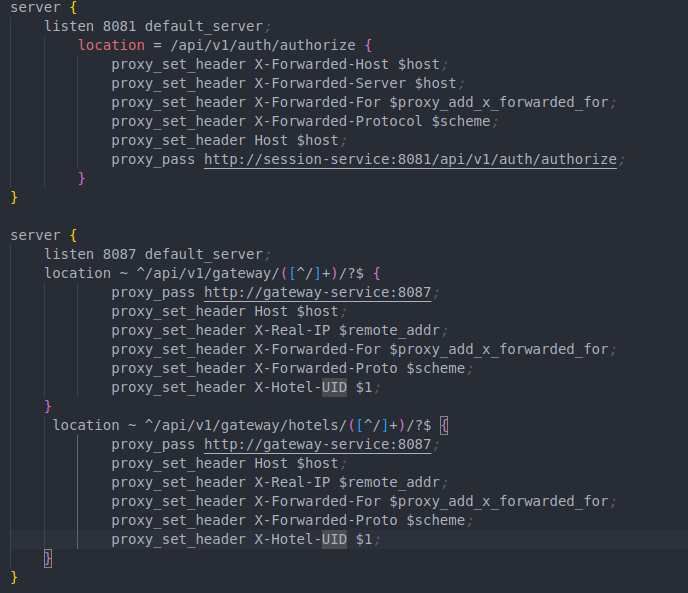
- Dockerfile для образа прокси  
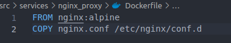  
- Конфигурация в docker-compose.yml   
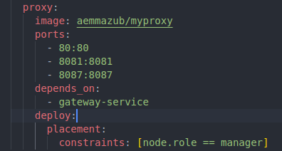
5) Прогнать заготовленные тесты через postman и удостовериться, что все они проходят успешно. В отчете отобразить результаты тестирования.   
**Решение:**   
- Запуск тестов в Postman
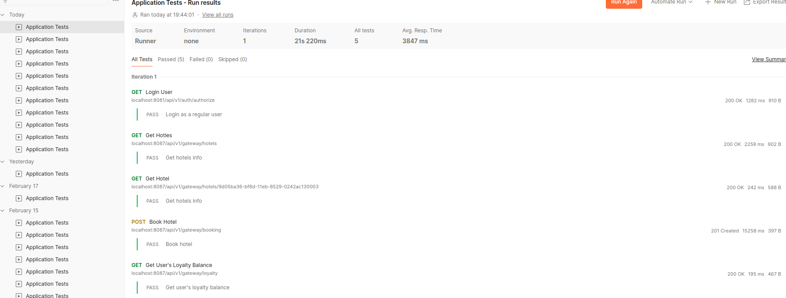

6) Используя команды docker, отобразить в отчете распределение контейнеров по узлам.
**Решение:** 
- Команда `docker stack services stage` выводит сервисы, который находятся в stage(стэк сервисов), все 
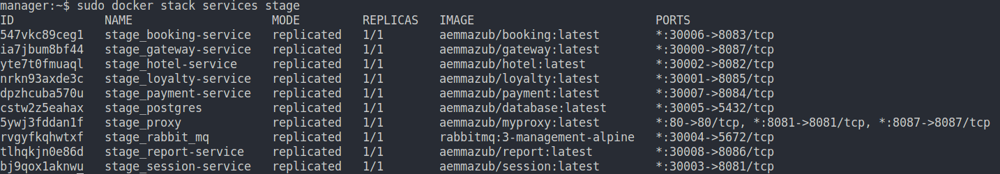
- Далее выводим контейнеры запущенные на 

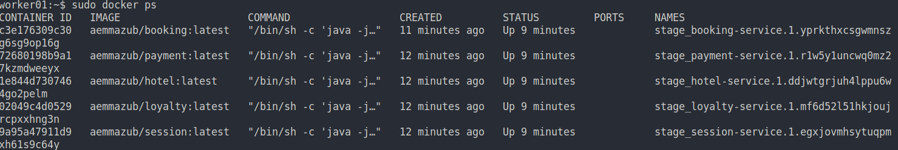
- Нормальная команда
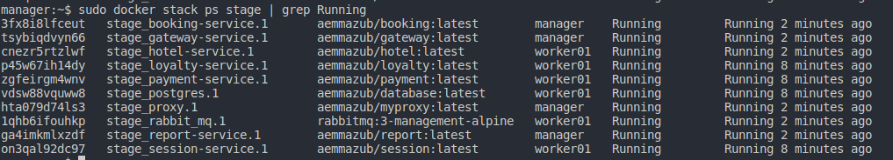

7) Установить отдельным стеком Portainer внутри кластера. В отчете отобразить визуализацию распределения задач по узлам с помощью Portainer.  
**Решение:**   
Dashboard
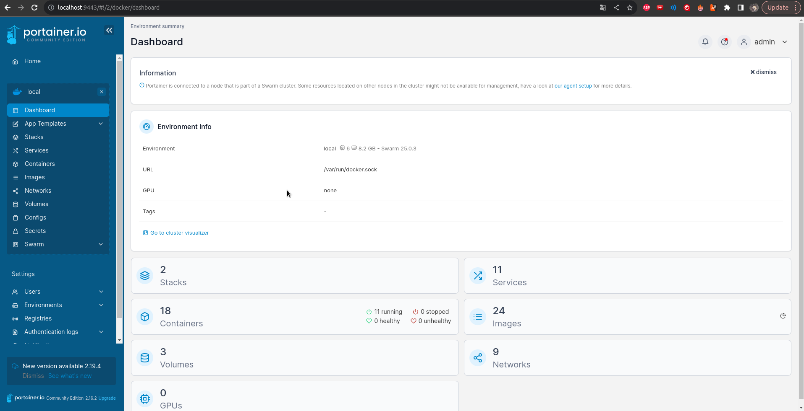
Services of stack stage
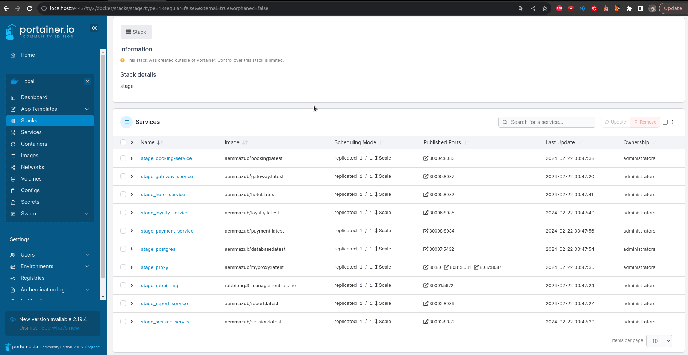
Cluster visualizator
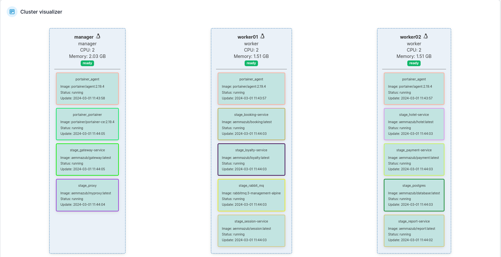