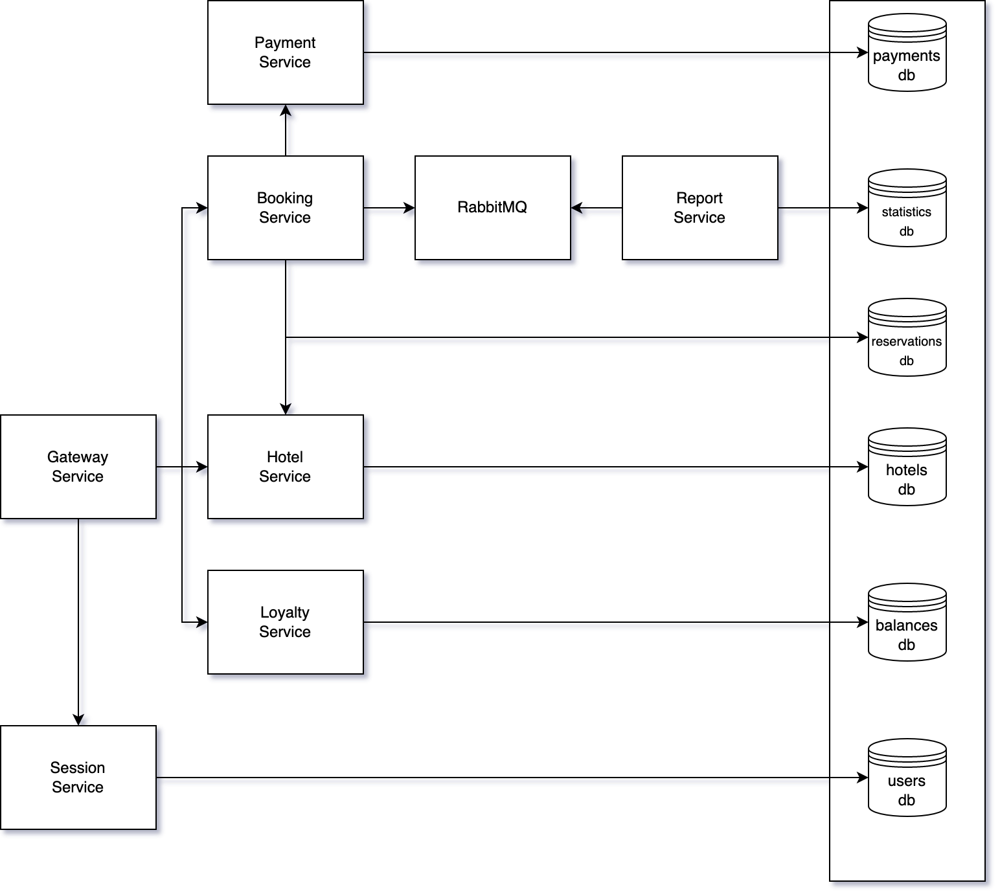

# Пример мультисервисного приложения

В папке `./src/` можно найти пример мультисервисного приложения. Ниже представлена его концептуальная схема.

Проект написан на языке java (jdk8).

Приложение представляет из себя сервис по бронированию номеров. Вернее его backend. Состоит этот backend из девяти частей (сервисов в терминологии docker-compose):

1. База данных postgres.
2. Очередь сообщений rabbitmq.
3. Session service - сервис управляющий сессиями пользователей.
4. Hotel service - сервис управляющий сущностью отелей.
5. Payment service - сервис управляющий оплатой.
6. Loyalty service - сервис управляющий программой лояльности.
7. Report service - сервис осуществляющий сбор статистики.
8. Booking service - сервис управляющий резервированием.
9. Gateway service - фасад для взаимодействия с остальными микросервисами

Начнем с двух первых сервисов. Для rabbitmq лучше всего использовать стандартный образ, так как никакой дополнительной настройки не потребуется.

Популяция начальными значениями баз данных postgres производится соответствующими сервисами автоматически, но сами базы данных надо создать, запустив скрипт `src\services\database\init.sql`

В случае с остальными же сервисами, придется поработать немного больше.

Для микросервисов производилась локальная сборка с последющим копированием собранного микросервиса во внутрь docker image.

Сервисы на Java ожидают некоторый набор переменных окружения:

### Session service

- POSTGRES_HOST: <хост бд>
- POSTGRES_PORT: 5432
- POSTGRES_USER : postgres
- POSTGRES_PASSWORD: "postgres" 
- POSTGRES_DB: users_db

### Hotel service

- POSTGRES_HOST: <хост бд>
- POSTGRES_PORT: 5432
- POSTGRES_USER : postgres  
- POSTGRES_PASSWORD: "postgres"  
- POSTGRES_DB: hotels_db

### Payment service

- POSTGRES_HOST: <хост бд>
- POSTGRES_PORT: 5432
- POSTGRES_USER : postgres  
- POSTGRES_PASSWORD: "postgres"  
- POSTGRES_DB: payments_db

### Loyalty service

- POSTGRES_HOST: <хост бд>
- POSTGRES_PORT: 5432
- POSTGRES_USER : postgres 
- POSTGRES_PASSWORD: "postgres" 
- POSTGRES_DB: balances_db

### Report service

- POSTGRES_HOST: <хост бд>
- POSTGRES_PORT: 5432
- POSTGRES_USER : postgres
- POSTGRES_PASSWORD: "postgres"
- POSTGRES_DB: statistics_db
- RABBIT_MQ_HOST: <хост очереди>
- RABBIT_MQ_PORT: 5672
- RABBIT_MQ_USER: guest
- RABBIT_MQ_PASSWORD: guest
- RABBIT_MQ_QUEUE_NAME: messagequeue
- RABBIT_MQ_EXCHANGE: messagequeue-exchange

### Booking service

- POSTGRES_HOST: <хост бд>
- POSTGRES_PORT: 5432
- POSTGRES_USER : postgres  
- POSTGRES_PASSWORD: "postgres"  
- POSTGRES_DB: reservations_db
- RABBIT_MQ_HOST: <хост очереди>
- RABBIT_MQ_PORT: 5672
- RABBIT_MQ_USER: guest
- RABBIT_MQ_PASSWORD: guest
- RABBIT_MQ_QUEUE_NAME: messagequeue
- RABBIT_MQ_EXCHANGE: messagequeue-exchange
- HOTEL_SERVICE_HOST: <хост hotel service>
- HOTEL_SERVICE_PORT: 8082
- PAYMENT_SERVICE_HOST: <хост payment service>
- PAYMENT_SERVICE_PORT: 8084
- LOYALTY_SERVICE_HOST: <хост loyalty service>
- LOYALTY_SERVICE_PORT: 8085

### Gateway service

- SESSION_SERVICE_HOST: <хост session service>
- SESSION_SERVICE_PORT: 8081
- HOTEL_SERVICE_HOST: <хост hotel service>
- HOTEL_SERVICE_PORT: 8082
- BOOKING_SERVICE_HOST: <хост booking service>
- BOOKING_SERVICE_PORT: 8083
- PAYMENT_SERVICE_HOST: <хост payment service>
- PAYMENT_SERVICE_PORT: 8084
- LOYALTY_SERVICE_HOST: <хост loyalty service>
- LOYALTY_SERVICE_PORT: 8085
- REPORT_SERVICE_HOST: <хост report service>
- REPORT_SERVICE_PORT: 8086

Сервисы открыты на соответствующих локальных портах:

- Session service - 8081
- Hotel service - 8082
- Booking service - 8083
- Payment service - 8084
- Loyalty service - 8085
- Report service - 8086
- Gateway service - 8087

